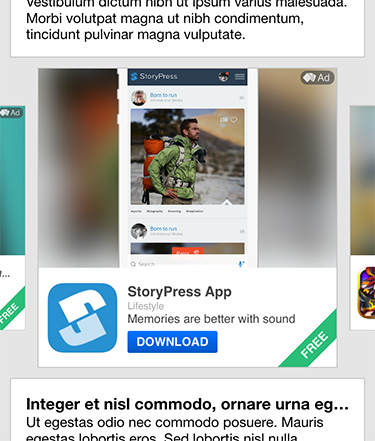

## Carousel

We developed a carousel that helps you to present several sashimi ads with (almost) no effort. Just insert the open source class `AFAdSDKCarouselSashimiView` inside your UITableView / UICollectionView, and increase your number of impressions without disturbing your users.

<center></center>

### Implementation

For a full integration example, please open the workspace and take a look at the project `AppsfireSDK-Example-Sashimi`.

We advise you to only instantiate one carousel object in your list class (and reuse it each time it must be displayed).

Three parameters are needed to programmatically instanciate the class:

+ frame of the view
+ subclass of sashimi view used
+ bitmask of effects applied to the ads

```objc
if (self.carouselView == nil) {
	self.carouselView = [[AFAdSDKCarouselSashimiView alloc] initWithFrame:CGRectMake(0.0, 0.0, CGRectGetWidth(cell.bounds), CGRectGetHeight(cell.bounds)) sashimiClass:[AFAdSDKSashimiExtendedView class] effects:AFAdSDKCarouselEffectScale];
}
```

### Easy customization

** Available effects **

We implemented two effects: fade (`AFAdSDKCarouselEffectFade`) and scale (`AFAdSDKCarouselEffectScale`). You even can choose to combine them!

** Any kind of sashimi **

In this example we put the template `sashimi extended`. But you could decide to put the minimal template, or even your own custom sashimi!


### Open source

As the source are visible, you can modify them! Feel free to suggest some modifications to the class.